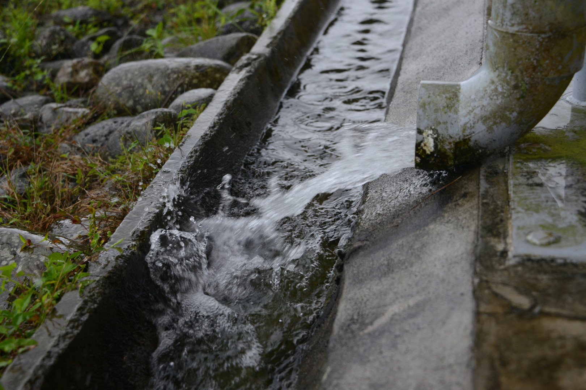

# PERFIL ACADÉMICO

**Nombre**: Josel Vargas

**profesion**: Ing. Ambiental

**lugar de trabajo**: senara

## Areas de interes 
1. calidad de aguas
2. analisis de datos
3. diseño de redes potabilizadoras

## cursos llevados 
* modelulos 1,2,3,4,5 de analisis de datos
    
* Ingles avanzado

## LINKS
[DIGHCR](https://dighcr.com/)

[ARTICULOS JOSEL](https://www.mdpi.com/2073-4441/13/19/2631)

## agregar imagen

